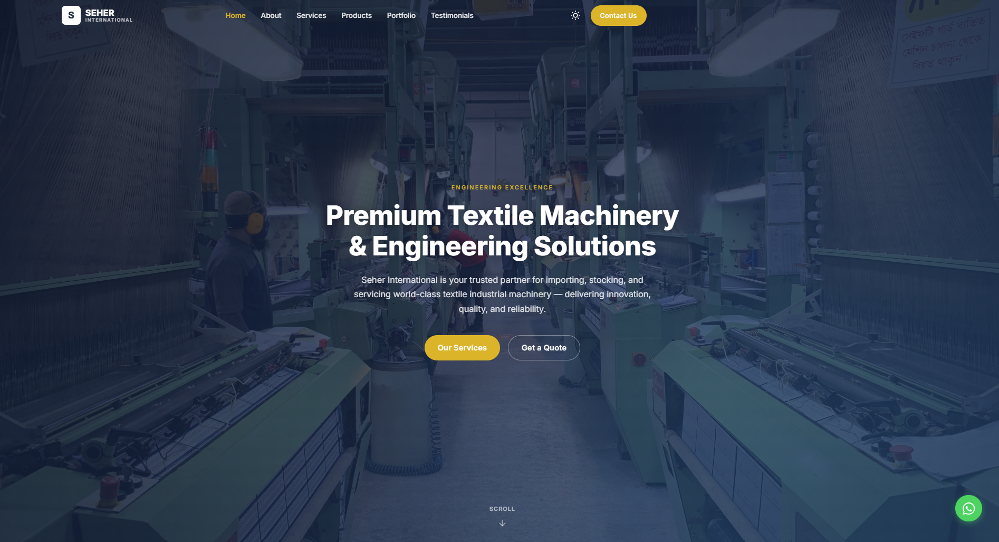
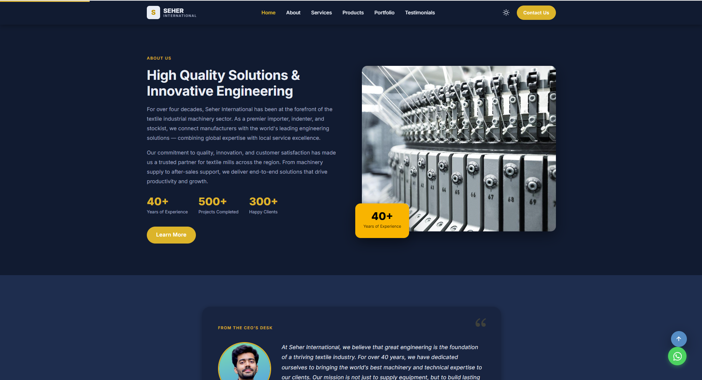
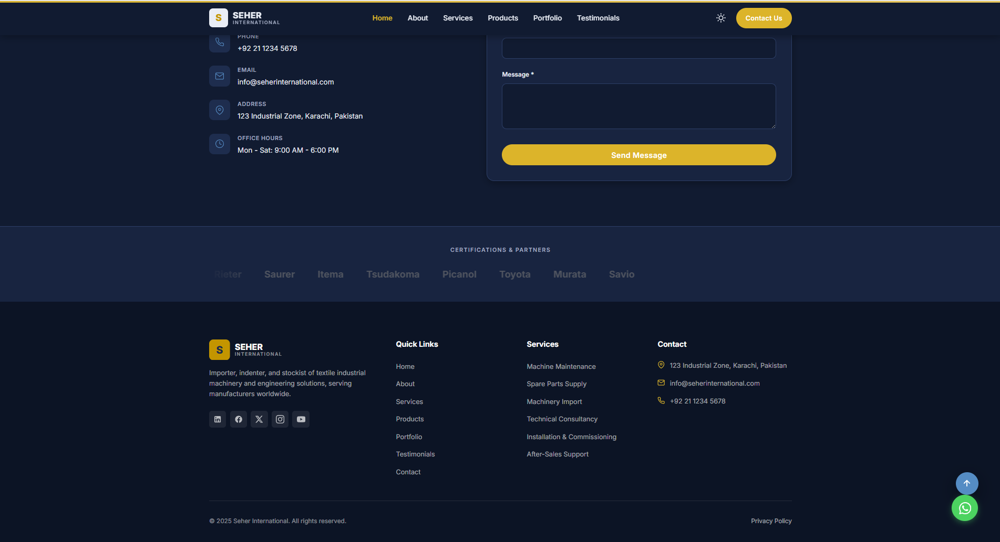
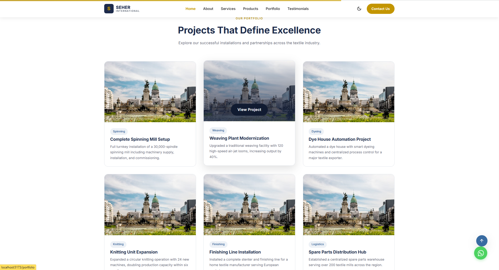
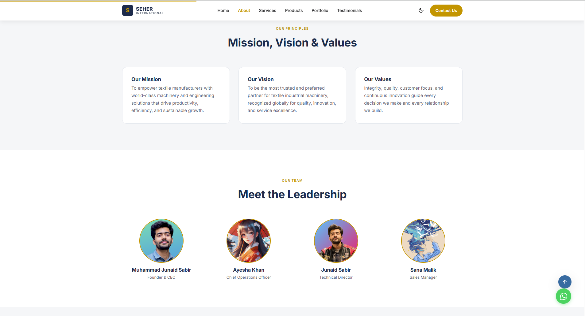

# PROJECT ABOUT

### Sample Business Portfolio Website

This is a very Advanced Sample Business Portfolio Website built with Vue.js and Vite.

**Tone:** Professional, modern, and elegant. Clean visual hierarchy, ample whitespace, easy navigation.

## Live Demo

[seher international website](https://vuejs-vite-advance-portfolio-web.vercel.app/)

## Features/Functions of the Website:

A very Modern and Advance Feature Website compatible to Desktop/Tablet/Mobile Screens.

1. The Website have total *15 Pages* (Home, About, Services, Service Detail, Products, Product Detail, Portfolio, Testimonials, Contact, Privacy Policy, and a 404 catch-all, ETC)
2. Performance Optimization: used latest and trending application development framework for *extremely fast* website loading and *excellent user experience*. Frameworks: VueJs and ViteJS.
3. Different Animations and Graphics and Advance functionalities:

	i) Transitions of color of navigation bar when scroll down

	ii) Transitions of color of icons and Cards when Hover

	iii) *Back to Top* button

	iv) *Reading Progress Bar* as the user scroll down

	v) *WhatsApp button* to directly opens WhatsApp number of Seher International

	vi) *Dark/Light* mode toggle button 

	vii) Page Preloader, when website loads it shows logo and company name

	viii) Animated number *counters* for Achievements & Statistics

	ix) Animated *motion graphic* of Certifications & Partners

4. Contact Us Page includes:

	a) *Map View* Location

	b) *Form* to fill

	c) Contact, email, address, timing

5. For *Search Engine Optimization*, used libraries and custom coding in website for advance SEO and website publicity
6. Dynamic *Image/Photos scaling* with respect to different Screen Sizes (Desktop/Tablet/Mobile)
7. Backend Data Format: JSON Files

## Tech Stack

- **Framework:** Vue 3 + Vite
- **Routing:** Vue Router 4 (with lazy-loaded route components using dynamic `import()`)
- **Styling:** CSS custom properties (design tokens) or Tailwind CSS — your choice, keep bundle lean
- **Deployment target:** Static export via `vite build` → GitHub repository → Hostinger static hosting
- **No WordPress, no PHP, no jQuery, no Bootstrap**

## Website Screenshots

### Website Navigation Bar and Hero Section

### Website Mid View

### Website Footer

### Cards Feature of Website

### Pictures and Multiple Pages of Website

